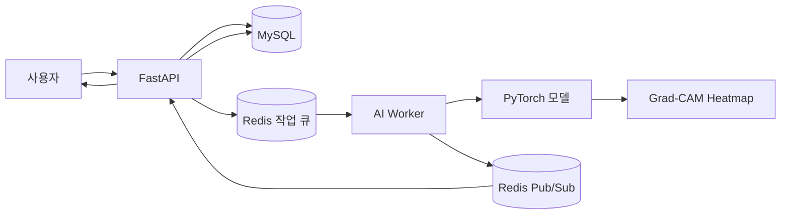

# AI Health Web Service

흉부 X-ray 이미지와 AI 모델을 활용하여 폐렴 여부를 예측하고, 환자 및 진료기록과 함께 예측 결과를 관리하는 FastAPI 기반 의료 AI 웹 서비스입니다.

사용자는 환자와 진료기록을 등록하고, 저장된 X-ray 이미지를 기반으로 AI 분석을 요청할 수 있습니다. FastAPI 서버가 Redis 작업 큐에 분석 요청을 등록하면 AI Worker가 추론과 Grad-CAM 생성을 수행하며, 결과는 데이터베이스에 저장되어 이후 요청에서 재사용됩니다.

---

## 1. 프로젝트 개요

### 1.1 프로젝트 목표

- 사용자 인증 및 권한 관리
- 환자 정보 등록·조회·수정·삭제
- 진료기록 및 흉부 X-ray 관리
- 저장된 X-ray 기반 폐렴 예측
- 동일 진료기록과 동일 모델의 기존 예측 결과 재사용
- 폐렴 예측 신뢰도와 Grad-CAM Heatmap 제공
- Redis를 이용한 FastAPI와 AI Worker 분리
- Docker Compose 기반 통합 실행 환경 구성

### 1.2 핵심 기능

| 기능 | 설명 |
| --- | --- |
| 사용자 인증 | 로그인, 로그아웃, Access Token 갱신 |
| 사용자 관리 | 관리자 권한을 통한 사용자 조회 및 관리 |
| 환자 관리 | 환자 등록, 목록, 상세, 수정, 삭제 |
| 진료기록 관리 | 진료기록과 흉부 X-ray 등록 및 조회 |
| AI 폐렴 예측 | 저장된 X-ray를 이용한 폐렴 여부 추론 |
| 예측 결과 재사용 | 같은 진료기록과 모델의 결과가 존재하면 재추론 생략 |
| Grad-CAM | 모델 판단 근거를 Heatmap 이미지로 제공 |
| 비동기 작업 처리 | Redis 작업 큐와 Pub/Sub을 이용한 Worker 연동 |
| 컨테이너 실행 | FastAPI, AI Worker, MySQL, Redis 통합 실행 |

---

## 2. 팀 구성

| GitHub 계정 | 프로젝트 참여 영역 |
| --- | --- |
| `dddong1234` | 프로젝트 조율, 공통 규칙, API·인증·리뷰 및 통합 |
| `qlctoa` | API 명세, 서비스 및 Redis 연동 작업 |
| `wnswlfhvkr-code` | 진료기록 API, 인프라 및 통합 작업 |
| `Gomin-art` | AI 모델 추론, Grad-CAM 및 Worker 작업 |

각 기능은 한 사람만 이해하고 구현하는 방식이 아니라, 공통 계약을 먼저 합의한 뒤 PR 리뷰와 통합 테스트를 통해 팀 전체가 동작을 이해하는 것을 원칙으로 진행했습니다.

---

# 프로젝트 과정 총정리

## 3. Team Rule 정의

프로젝트 시작 단계에서 팀원들이 같은 방식으로 협업할 수 있도록 다음 규칙을 먼저 정했습니다.

### 3.1 커뮤니케이션 규칙

- 작업 시작 전에 담당 범위와 예상 산출물을 공유합니다.
- API 경로, 데이터 모델, 공용 함수의 입출력은 구현 전에 합의합니다.
- 작업 중 공통 코드 변경이 필요하면 다른 담당자에게 먼저 공유합니다.
- 문제 상황은 개인적으로 오래 보유하지 않고 팀 채팅방에 빠르게 공유합니다.
- AI Agent를 사용할 수 있지만, 작성된 코드와 문서는 담당자뿐 아니라 팀 전체가 설명할 수 있어야 합니다.

### 3.2 코드 작성 규칙

- FastAPI 기능은 `APIRouter` 단위로 분리합니다.
- Router, Schema, Service, Repository, Model의 책임을 분리합니다.
- 인증과 권한 검사는 공통 Dependency를 재사용합니다.
- 프로젝트 전역 오류 응답 형식을 따릅니다.
- 환경별 값과 비밀정보는 `.env`로 관리합니다.
- 실행 중 생성되는 업로드 파일과 테스트 산출물은 Git에 커밋하지 않습니다.
- 모델 및 API 사이의 반환 필드명은 합의 없이 변경하지 않습니다.

초기 API 구현 리뷰에서는 `@app.get()` 대신 `APIRouter`를 사용해 기능별로 분리하자는 의견이 제시되었고, 이를 코드에 반영했습니다.

관련 기록:

- [PR #1 — Team Rule 수정](https://github.com/dddong1234/AH_web_dev/pull/1)
- [PR #11 — APIRouter 구조 리뷰 및 반영](https://github.com/dddong1234/AH_web_dev/pull/11)

### 3.3 PR 리뷰 규칙

- 기능 구현은 별도 브랜치에서 진행합니다.
- PR 본문에 작업 내용과 검증 방법을 작성합니다.
- 다른 팀원의 리뷰를 받은 뒤 통합 브랜치에 병합합니다.
- 리뷰에서 발견된 문제는 수정 커밋을 추가한 뒤 재검토를 요청합니다.
- 전역 설정 변경은 기능 PR에 섞지 않고 영향 범위를 먼저 확인합니다.
- Blocking issue가 해소된 것을 확인한 뒤 병합합니다.

진료기록 API PR에서는 다음 사항을 실제로 리뷰하고 수정했습니다.

- Form 데이터에 Pydantic 검증 적용
- 인증 Dependency의 불필요한 전역 변경 원복
- 테스트용 X-ray 파일의 Git 추적 제거
- 문서와 전역 오류 코드 동기화
- 수정 후 재검토하여 Blocking issue가 없음을 확인

관련 기록:

- [PR #44 — 진료기록 등록 API 리뷰](https://github.com/dddong1234/AH_web_dev/pull/44)

---

## 4. 사용자 요구사항 정의

교육 과정에서 제공된 사용자 요구사항을 읽고, 이를 현재 프로젝트 구조에 적용 가능한 기능으로 해석했습니다.

### 4.1 사용자 및 인증 요구사항

- 사용자는 이메일과 비밀번호로 로그인할 수 있어야 합니다.
- 로그인된 사용자는 로그아웃할 수 있어야 합니다.
- Refresh Token을 이용해 Access Token을 갱신할 수 있어야 합니다.
- 승인된 사용자만 환자와 진료기록 기능에 접근할 수 있어야 합니다.
- 인증 누락과 권한 부족은 서로 다른 상태 코드와 오류 코드로 응답해야 합니다.

### 4.2 환자 및 진료기록 요구사항

- 승인된 사용자는 환자를 등록할 수 있어야 합니다.
- 환자 목록과 상세 정보를 조회할 수 있어야 합니다.
- 환자 정보를 수정하거나 삭제할 수 있어야 합니다.
- 환자의 진료기록을 등록하고 조회할 수 있어야 합니다.
- 진료기록 등록 시 흉부 X-ray 이미지를 저장할 수 있어야 합니다.
- URL의 `patient_id`와 `record_id` 관계를 검증해야 합니다.

### 4.3 AI 폐렴 예측 요구사항

#### REQ-PRED-001 — AI 모델 활용 폐렴 예측

- 승인된 의료·개발·연구 관련 사용자는 진료기록 상세 화면에서 AI 예측 결과를 확인할 수 있어야 합니다.
- 예측에는 별도로 업로드받은 이미지가 아니라 진료기록 저장 시 등록된 X-ray를 사용합니다.
- 같은 진료기록과 같은 모델로 저장된 결과가 있으면 재추론하지 않고 기존 결과를 반환합니다.
- 결과에는 폐렴 여부, Confidence, Heatmap URL이 포함됩니다.

#### REQ-PRED-002 — AI 예측 결과 조회

- 진료기록 상세 화면에서 해당 진료기록의 AI 예측 결과 목록을 확인할 수 있어야 합니다.
- 목록에는 다음 정보가 포함됩니다.
  - 결과 ID
  - 폐렴 여부
  - Confidence
  - Heatmap URL
  - 예측 수행 시각
  - 사용한 AI 모델

#### 비기능 요구사항

- Recall은 최소 `0.90`을 목표로 합니다.
- Accuracy는 보조 지표로 `0.80~0.90`을 목표로 합니다.
- 모든 API는 3초 이내 응답을 목표로 합니다.

### 4.4 범위 결정

팀 논의를 통해 다음과 같이 범위를 확정했습니다.

포함 범위:

- 저장된 진료기록의 X-ray 기반 폐렴 예측
- 기존 결과 조회 및 재사용
- 신규 예측 결과 저장
- 결과 목록 조회
- Grad-CAM Heatmap 생성
- 권한 검증

제외 범위:

- 독립적인 X-ray 임시 업로드 예측 API
- 모델 학습 및 재학습 API
- 예측 결과 수정·삭제
- 요구사항에 없는 별도 통계 API

이 결정으로 요구사항에 없는 기능을 추가하기보다, 진료기록 상세 화면의 AI 분석 흐름에 집중할 수 있었습니다.

---

## 5. API 명세서 작성

기능 구현 전에 담당자 사이의 충돌을 줄이기 위해 API와 모델 추론 계약을 문서로 먼저 작성했습니다.

주요 API:

| Method | Path | 설명 |
| --- | --- | --- |
| `POST` | `/api/v1/patients/{patient_id}/medical-records/{record_id}/ai-analyses` | 기존 결과 반환 또는 신규 폐렴 예측 수행 |
| `GET` | `/api/v1/patients/{patient_id}/medical-records/{record_id}/ai-analyses` | 진료기록별 AI 예측 결과 목록 조회 |

### 5.1 POST 처리 흐름

1. 사용자 인증과 권한을 확인합니다.
2. 환자와 진료기록의 존재 여부 및 소유 관계를 확인합니다.
3. 진료기록에 저장된 X-ray를 조회합니다.
4. 같은 `record_id + ai_model`의 결과를 조회합니다.
5. 기존 결과가 있으면 재추론 없이 반환합니다.
6. 기존 결과가 없으면 Redis 작업 큐에 AI 분석 작업을 등록합니다.
7. AI Worker가 폐렴 추론과 Grad-CAM 생성을 수행합니다.
8. FastAPI가 결과를 받아 데이터베이스에 저장합니다.
9. 저장된 결과를 사용자에게 반환합니다.

### 5.2 공용 응답 형식

```json
{
  "id": 1,
  "record_id": 10,
  "is_pneumonia": true,
  "confidence": 94.5,
  "heatmap_url": "/uploads/heatmaps/10/550e8400-e29b-41d4-a716-446655440000.png",
  "ai_model": "v8-lite-densenet121-fp16",
  "created_at": "2026-07-22T10:00:00Z",
  "updated_at": null
}
```

### 5.3 모델 추론 계약

```python
def predict_pneumonia(
    image_path: str | Path,
    record_id: int,
) -> dict:
    """
    Returns:
        {
            "is_pneumonia": bool,
            "confidence": float,
            "heatmap_url": str,
            "heatmap_path": str,
        }
    """
```

공통 규칙:

- 모델 입력 크기: `224x224`
- 입력 채널: RGB 3채널
- 전처리: ImageNet mean/std 정규화
- 클래스 `0`: normal
- 클래스 `1`: pneumonia
- 모델 모듈: `worker/model.py`
- 모델명: `v8-lite-densenet121-fp16`
- Heatmap 저장 경로: `uploads/heatmaps/{record_id}/{uuid}.png`
- DB 저장 경로: `heatmaps/{record_id}/{uuid}.png`
- 응답 URL: `/uploads/heatmaps/{record_id}/{uuid}.png`

명세 리뷰 과정에서 전체 API Timeout을 3초로 통일하고, 모델 함수명과 Heatmap 저장 규칙을 구현 전에 확정했습니다.

관련 기록:

- [폐렴 예측 API 설계 문서](docs/6일차_폐렴예측_API_설계.md)
- [PR #48 — 폐렴 예측 API 설계](https://github.com/dddong1234/AH_web_dev/pull/48)

---

## 6. Git & GitHub Branch 전략 구성

### 6.1 브랜치 역할

| 브랜치 | 역할 |
| --- | --- |
| `main` | 과제 단계가 완료된 최종 결과 |
| `develop` | 팀 기능을 모으고 통합 검증하는 기본 개발 브랜치 |
| `feat/*` | 기능 개발 |
| `fix/*` | 버그 수정 |
| `docs/*` | 문서 작성 및 수정 |
| `chore/*` | 설정과 개발 환경 변경 |
| `infra/*` | Docker, Redis 등 인프라 변경 |
| `merge/*` | 여러 기능 브랜치의 단계별 통합 |

### 6.2 작업 흐름

```text
main
  └─ develop
       ├─ feat/auth-login
       ├─ feat/patient-api
       ├─ feat/medical-api
       ├─ feat/stage6-common-rules
       ├─ feat/pneumonia-inference
       ├─ feat/ai-analysis-api
       ├─ feat/redis-worker
       └─ infra/app-worker-separation
```

1. `develop`에서 작업 브랜치를 생성합니다.
2. 담당 기능을 구현하고 로컬 검증을 수행합니다.
3. 작업 브랜치를 원격 저장소에 Push합니다.
4. `develop`을 대상으로 PR을 생성합니다.
5. 팀원이 코드와 문서를 검토합니다.
6. 리뷰 내용을 반영하고 재검토를 받습니다.
7. 승인된 PR을 `develop`에 병합합니다.
8. 단계별 통합 검증 후 최종 결과를 `main`에 병합합니다.

### 6.3 적용 결과

실제 프로젝트에서는 기능별 PR을 통해 다음 작업들을 순차적으로 통합했습니다.

- 사용자 및 인증 API
- 환자·진료기록 공통 기반
- 환자 CRUD
- 진료기록 등록 및 조회
- Stage 6 공통 규칙
- 폐렴 예측 API 명세
- 폐렴 추론 및 Grad-CAM
- 예측 결과 저장·조회
- Redis 작업 큐와 AI Worker
- Docker 및 의존성 분리

---

## 7. 프로젝트 세팅

### 7.1 기술 스택

#### Backend

- Python 3.13+
- FastAPI
- Pydantic
- SQLAlchemy Async
- Alembic
- PyJWT
- Argon2

#### AI

- PyTorch
- TorchVision
- DenseNet121 기반 폐렴 분류 모델
- Grad-CAM
- Pillow
- NumPy

#### Database and Messaging

- MySQL 8.0
- Redis 7
- Redis List 기반 작업 큐
- Redis Pub/Sub 기반 결과 전달

#### Infrastructure

- Docker
- Docker Compose
- uv
- NVIDIA Container Toolkit 선택 지원

### 7.2 환경 설정

```bash
cp .env.example .env
uv sync --all-extras
```

App과 AI Worker의 의존성은 `pyproject.toml`의 Optional Dependency로 분리했습니다.

```toml
[project.optional-dependencies]
app = [
    "fastapi[standard]",
    "sqlalchemy[asyncio]",
    "alembic",
    "redis",
]

ai = [
    "torch",
    "torchvision",
    "numpy",
    "pillow",
    "redis",
]
```

패키지 검색 대상에는 App, Worker, Shared 모듈을 모두 포함했습니다.

```toml
[tool.setuptools.packages.find]
include = ["app*", "worker*", "shared*"]
```

### 7.3 데이터베이스 초기화

```bash
docker compose up -d mysql
uv run alembic upgrade head
uv run python scripts/seed_admin.py
```

### 7.4 로컬 서버 실행

```bash
uv run fastapi run app/main.py
```

확인 주소:

```text
http://localhost:8000/
http://localhost:8000/healthcheck
```

---

## 8. API 및 AI Worker 코드 작성 후 Branch 전략을 통한 병합

### 8.1 환자 및 진료기록 기능

환자와 진료기록 기능은 공통 Model과 Enum을 먼저 확정한 뒤 API를 세분화하여 구현했습니다.

주요 작업:

- 공통 Model Enum 정의
- User 및 의료 데이터 Model 작성
- Alembic 마이그레이션 구성
- 환자 등록·목록·상세·수정·삭제
- 진료기록 등록·목록·상세
- X-ray 파일 저장
- 인증 및 권한 Dependency 연결
- Swagger 오류 응답 문서화

관련 PR:

- [PR #16 — 공통 모델 Enum](https://github.com/dddong1234/AH_web_dev/pull/16)
- [PR #17 — User 모델](https://github.com/dddong1234/AH_web_dev/pull/17)
- [PR #37 — 환자·진료기록 공통 기반](https://github.com/dddong1234/AH_web_dev/pull/37)
- [PR #39 — 환자 목록 API](https://github.com/dddong1234/AH_web_dev/pull/39)
- [PR #40 — 환자 상세 API](https://github.com/dddong1234/AH_web_dev/pull/40)
- [PR #43 — 환자 수정·삭제 API](https://github.com/dddong1234/AH_web_dev/pull/43)
- [PR #44 — 진료기록 등록 API](https://github.com/dddong1234/AH_web_dev/pull/44)
- [PR #45 — 진료기록 목록·상세 API](https://github.com/dddong1234/AH_web_dev/pull/45)

### 8.2 AI 추론 및 Grad-CAM

AI 담당자는 공통 계약에 따라 다음 기능을 구현했습니다.

- 모델을 메모리에 로드
- X-ray 전처리
- 폐렴 여부 및 Confidence 계산
- 마지막 Convolution Layer 기반 Grad-CAM 생성
- Heatmap 파일 저장
- API 계층에서 사용할 URL과 DB 상대경로 반환

리뷰 과정에서 다음 문제를 수정했습니다.

- `heatmap_path` 반환값 추가
- CLI 실행부의 함수 인자 불일치 수정
- `worker` 패키지를 설치 대상에 추가
- 추론 결과 경로와 패키지 설정 정리

관련 PR:

- [PR #49 — 폐렴 추론 및 Grad-CAM 구현](https://github.com/dddong1234/AH_web_dev/pull/49)
- [PR #51 — 폐렴 추론 CLI 인자 수정](https://github.com/dddong1234/AH_web_dev/pull/51)

### 8.3 폐렴 예측 API 및 결과 저장

API 담당자는 다음 기능을 구현했습니다.

- 진료기록의 X-ray 조회
- 기존 AI 결과 조회
- 신규 AI 추론 실행
- 결과 데이터베이스 저장
- 결과 목록 조회
- Heatmap 경로 변환
- 실패 시 생성 파일 정리
- API Timeout 처리

`asyncio.to_thread()`와 `asyncio.wait_for()`를 함께 사용할 때 Timeout 이후에도 Worker Thread가 계속 실행될 수 있다는 리뷰가 있었습니다. 이 경우 응답은 `504`이지만 Heatmap 파일이 뒤늦게 생성되어 고아 파일이 남을 수 있으므로, 파일 정리와 통합 테스트를 추가로 확인했습니다.

또한 첫 요청에서 모델 Cold Start 때문에 `504`가 발생하는 문제를 발견했고, 애플리케이션 시작 시 모델을 미리 로드하도록 개선했습니다.

관련 PR:

- [PR #50 — 폐렴 예측 API 및 결과 저장·조회](https://github.com/dddong1234/AH_web_dev/pull/50)
- [PR #54 — Cold Start 504 오류 수정](https://github.com/dddong1234/AH_web_dev/pull/54)

---

## 9. 아키텍처 설계 및 적용

### 9.1 초기 구조

초기에는 FastAPI 프로세스에서 `asyncio.to_thread()`로 AI 모델 추론을 실행했습니다.

```text
Client
  → FastAPI
    → Service
      → Worker Model
        → PyTorch Inference
        → Grad-CAM
      → MySQL
  ← Response
```

이 구조는 구현이 단순하지만 다음 문제가 있었습니다.

- AI 의존성이 API 서버에 포함됨
- 모델 Cold Start가 API 응답시간에 직접 영향
- Timeout 후 Thread 작업을 즉시 중단하기 어려움
- API와 AI Worker의 독립적인 확장 불가
- GPU 환경과 일반 API 환경의 분리 어려움

### 9.2 최종 구조

위 문제를 개선하기 위해 FastAPI와 AI Worker를 Redis를 기준으로 분리했습니다.



### 9.3 컴포넌트 책임

| 컴포넌트 | 책임 |
| --- | --- |
| FastAPI Router | 요청 검증, 인증·권한 확인, 응답 Schema 선언 |
| Service | 환자·진료기록 검증, 기존 결과 재사용, 작업 요청 및 결과 저장 |
| Repository | AI 결과 조회·저장·목록 처리 |
| MySQL | 사용자, 환자, 진료기록, AI 분석 결과 영속화 |
| Redis Queue | AI 분석 작업 전달 |
| Redis Pub/Sub | Worker 처리 결과 전달 |
| AI Worker | 이미지 전처리, 모델 추론, Grad-CAM 생성 |
| Upload Storage | X-ray와 Heatmap 파일 저장 |

### 9.4 AI 작업 처리 흐름

```text
1. 사용자가 진료기록 AI 분석 API를 호출한다.
2. FastAPI가 인증, 권한, 환자, 진료기록을 검증한다.
3. 기존 record_id + ai_model 결과를 조회한다.
4. 기존 결과가 있으면 즉시 반환한다.
5. 기존 결과가 없으면 Redis Queue에 작업을 등록한다.
6. AI Worker가 BRPOP으로 작업을 가져간다.
7. Worker가 X-ray 전처리와 폐렴 추론을 수행한다.
8. Worker가 Grad-CAM Heatmap을 생성한다.
9. Worker가 Redis Pub/Sub으로 결과를 발행한다.
10. FastAPI가 결과를 받아 MySQL에 저장한다.
11. 저장된 AI 분석 결과를 사용자에게 반환한다.
```

### 9.5 공유 계약

FastAPI와 Worker가 서로 다른 프로세스로 실행되므로 `shared` 패키지를 통해 작업 및 결과 메시지 형식을 공유했습니다.

이 방식으로 다음 문제를 방지했습니다.

- App과 Worker의 필드명 불일치
- Redis 메시지 직렬화 형식 불일치
- 모델 결과 해석 차이
- Heatmap 경로 규칙 불일치

관련 PR:

- [PR #58 — Redis 공유 Queue 계약](https://github.com/dddong1234/AH_web_dev/pull/58)
- [PR #62 — FastAPI·Redis·Worker 통합](https://github.com/dddong1234/AH_web_dev/pull/62)
- [PR #63 — Redis BRPOP Timeout 처리](https://github.com/dddong1234/AH_web_dev/pull/63)

---

## 10. Docker 인프라 관련 파일 작성

### 10.1 서비스 구성

Docker Compose는 다음 서비스를 실행합니다.

| 서비스 | 역할 | 기본 포트 |
| --- | --- | --- |
| `fastapi` | REST API 및 웹 서비스 | `8000` |
| `ai-worker` | 폐렴 추론 및 Grad-CAM | 내부 서비스 |
| `mysql` | 관계형 데이터베이스 | `3306` |
| `redis` | 작업 큐 및 Pub/Sub | `6379` |

### 10.2 Docker 파일 분리

App과 AI Worker의 실행 환경을 분리했습니다.

```text
app/Dockerfile
worker/Dockerfile
docker-compose.yml
docker-compose.gpu.yml
```

분리 목적:

- FastAPI 이미지에서 PyTorch와 CUDA 의존성 제거
- AI Worker만 AI 관련 패키지 설치
- API 서버와 Worker의 독립적인 빌드·배포
- GPU 사용 여부에 따른 실행 환경 선택
- Worker 수평 확장 지원

관련 PR:

- [PR #57 — Docker 개발 환경 정리](https://github.com/dddong1234/AH_web_dev/pull/57)
- [PR #64 — App·Worker 의존성 및 Docker 환경 분리](https://github.com/dddong1234/AH_web_dev/pull/64)

---

# 실행 방법

## 11. 전체 서비스 실행

### 11.1 준비 사항

- Python 3.13 이상
- uv
- Docker Desktop
- GPU 사용 시 NVIDIA Container Toolkit

### 11.2 환경 파일 생성

```bash
cp .env.example .env
```

### 11.3 의존성 설치

App과 AI Worker 의존성을 모두 설치합니다.

```bash
uv sync --all-extras
```

### 11.4 Docker 이미지 빌드

```bash
docker compose build fastapi ai-worker
```

### 11.5 전체 서비스 시작

```bash
docker compose up -d mysql redis fastapi ai-worker
```

### 11.6 실행 상태 확인

```bash
docker compose ps
```

### 11.7 Redis 확인

```bash
docker compose exec redis redis-cli ping
```

정상 응답:

```text
PONG
```

### 11.8 API 확인

```text
http://localhost:8000/
http://localhost:8000/healthcheck
http://localhost:8000/docs
```

### 11.9 로그 확인

FastAPI:

```bash
docker compose logs -f fastapi
```

AI Worker:

```bash
docker compose logs -f ai-worker
```

### 11.10 서비스 종료

```bash
docker compose down
```

MySQL 볼륨까지 삭제:

```bash
docker compose down -v
```

> `-v` 옵션은 기존 MySQL 데이터를 삭제하므로 필요한 경우에만 사용합니다.

---

## 12. GPU 환경 실행

```bash
docker compose \
  -f docker-compose.yml \
  -f docker-compose.gpu.yml \
  up -d mysql redis fastapi ai-worker
```

GPU 사용 여부 확인:

```bash
docker compose \
  -f docker-compose.yml \
  -f docker-compose.gpu.yml \
  exec ai-worker python -c "import torch; print(torch.cuda.is_available())"
```

`True`가 출력되면 AI Worker가 GPU를 사용할 수 있습니다.

---

## 13. AI Worker 확장

AI Worker는 Redis의 `BRPOP`을 사용하여 작업을 소비합니다. 여러 Worker가 대기하더라도 하나의 작업은 하나의 Worker만 처리합니다.

```bash
docker compose up -d --scale ai-worker=3
```

이를 통해 API 서버를 변경하지 않고 AI 추론 처리량을 늘릴 수 있습니다.

---

## 14. Alembic Migration

### 마이그레이션 생성

```bash
uv run alembic revision --autogenerate -m "변경 내용"
```

### 최신 마이그레이션 적용

```bash
uv run alembic upgrade head
```

### 마지막 마이그레이션 취소

```bash
uv run alembic downgrade -1
```

---

# 프로젝트 회고

## 15. 잘 진행된 점

### 15.1 구현 전에 공통 계약을 확정한 점

AI 모델과 API를 서로 다른 담당자가 구현했기 때문에 다음 내용을 먼저 문서로 고정한 것이 효과적이었습니다.

- 추론 함수명
- 이미지 입력 규격
- 클래스 매핑
- Confidence 범위
- Heatmap 저장 경로
- API 응답 필드
- 모델명과 버전
- 기존 결과 재사용 조건

이를 통해 모델 코드와 API 코드 병합 시 발생할 수 있는 필드명과 경로 불일치를 줄였습니다.

### 15.2 PR 리뷰를 실제 수정으로 연결한 점

리뷰를 승인 절차로만 사용하지 않고 다음 문제들을 발견하고 수정했습니다.

- Router 구조 개선
- 입력값 검증 누락
- 인증 Dependency의 불필요한 전역 변경
- 오류 문서와 실제 응답 불일치
- 테스트 이미지의 Git 추적
- CLI 함수 인자 불일치
- Worker 패키지 설치 누락
- Timeout 후 Heatmap 정리 문제
- 모델 Cold Start로 인한 첫 요청 `504`
- Redis Worker의 `BRPOP` Timeout 처리
- 의존성 분리 이후 오래된 설치 명령 수정

### 15.3 API와 AI Worker를 분리한 점

초기에는 한 프로세스 안에서 추론했지만, 최종적으로 Redis를 중심으로 FastAPI와 AI Worker를 분리했습니다.

이로 인해 다음 장점을 얻었습니다.

- API와 AI 의존성 분리
- Worker 독립 확장
- GPU 환경 선택
- 모델 작업이 API Event Loop에 직접 미치는 영향 감소
- 컨테이너별 책임 명확화

---

## 16. 어려웠던 점과 해결 과정

### 16.1 요구사항 범위 해석

처음에는 사용자가 이미지를 직접 업로드하는 독립 예측 API까지 고려했지만, 요구사항을 다시 분석한 결과 핵심은 저장된 진료기록의 X-ray를 사용하는 흐름이었습니다.

따라서 다음과 같이 범위를 줄였습니다.

- 독립 업로드 예측 API 제외
- 진료기록 상세 기반 분석에 집중
- 실행 API와 결과 목록 API 구현
- 동일 모델 결과 저장 및 재사용

### 16.2 모델과 API 인터페이스 불일치

문서에서는 `predict_pneumonia()`를 기준으로 했지만 공유 모델은 `V8LitePredictor.predict_image()` 형태였습니다.

이를 해결하기 위해 `worker/model.py`에서 공용 Wrapper 함수를 제공하고, API는 내부 모델 구현을 알지 않아도 되도록 구성했습니다.

### 16.3 Timeout과 동기 추론

동기 PyTorch 연산을 `asyncio.to_thread()`로 실행할 경우 Coroutine Timeout이 발생해도 Thread 자체는 즉시 종료되지 않을 수 있었습니다.

리뷰를 통해 다음 위험을 확인했습니다.

- `504` 응답 이후 Heatmap 생성 가능
- DB 결과 없이 고아 파일 발생 가능
- 다음 요청에서 같은 추론을 다시 실행할 가능성

이 문제를 계기로 추론을 별도 AI Worker로 이동하고 Redis 기반 메시지 처리 구조로 발전시켰습니다.

### 16.4 모델 Cold Start

서버 시작 후 첫 요청에서 모델 로딩까지 수행하면서 3초 제한을 넘는 문제가 있었습니다.

애플리케이션 시작 단계에서 모델을 미리 로드해 첫 분석 요청이 즉시 추론을 시작하도록 개선했습니다. 이후에는 API와 Worker를 분리하여 Worker 시작 시 모델을 준비하도록 책임을 명확히 했습니다.

### 16.5 통합 환경 차이

개별 개발 환경에서는 동작하지만 Docker 통합 과정에서 다음 문제가 발생했습니다.

- App과 Worker 의존성 충돌
- Worker 패키지 설치 누락
- Redis 연결 주소 차이
- 공유 Upload 경로 불일치
- CPU와 GPU 환경 차이
- Docker 빌드 및 Frontend 연동 문제

App과 Worker의 Dockerfile 및 Optional Dependency를 분리하고, Docker Compose에서 Redis와 Upload Volume을 공유하여 해결했습니다.

---

## 17. 개선할 점

- PR 제목과 브랜치 이름 규칙을 더 일관되게 적용할 필요가 있습니다.
- PR 본문에 테스트 방법과 결과를 필수 항목으로 정착시킬 필요가 있습니다.
- 단위 테스트와 통합 테스트를 자동화해야 합니다.
- GitHub Actions를 이용해 Lint, Test, Docker Build를 자동 검증할 필요가 있습니다.
- Redis 작업 실패 시 재시도와 Dead Letter Queue 전략을 추가할 필요가 있습니다.
- Worker 장애 시 작업 상태를 추적할 수 있는 상태 관리가 필요합니다.
- Heatmap 및 X-ray를 로컬 파일 시스템 대신 Object Storage로 이전할 필요가 있습니다.
- 모델 평가 지표와 검증 데이터셋 결과를 버전별로 관리할 필요가 있습니다.
- 운영 환경에서는 Secret, HTTPS, CORS, 로그 마스킹 정책을 강화해야 합니다.
- `main`과 `develop`의 보호 규칙 및 필수 리뷰어 설정을 적용할 필요가 있습니다.

---

## 18. 최종 결과

이 프로젝트를 통해 단순히 FastAPI 엔드포인트를 작성하는 것을 넘어 다음 과정을 경험했습니다.

1. 팀 규칙 정의
2. 사용자 요구사항 분석
3. 기능 범위 결정
4. API 명세 작성
5. 데이터 모델 및 공용 인터페이스 설계
6. Git Branch 전략 수립
7. 기능별 병렬 개발
8. PR 리뷰와 피드백 반영
9. 환자·진료기록 API 구현
10. AI 폐렴 추론 및 Grad-CAM 구현
11. AI 결과 저장 및 재사용 구현
12. Redis 기반 API·Worker 분리
13. Docker 인프라 구성
14. 통합 테스트 및 오류 수정
15. `develop` 통합 후 `main` 최종 병합

초기에는 하나의 FastAPI 애플리케이션에서 모든 작업을 처리하는 구조로 시작했지만, 요구사항과 성능 문제를 검토하면서 Redis 작업 큐와 독립 AI Worker를 사용하는 구조로 발전시켰습니다.

무엇보다 기능을 개인별로 분리하는 데 그치지 않고, 공통 계약을 문서화하고 PR 리뷰를 통해 서로의 작업을 검증하면서 팀 전체가 프로젝트 구조와 코드 흐름을 이해하는 것을 목표로 진행했습니다.

---

## 19. 주요 Pull Request

| PR | 내용 |
| --- | --- |
| [#1](https://github.com/dddong1234/AH_web_dev/pull/1) | Team Rule 수정 |
| [#11](https://github.com/dddong1234/AH_web_dev/pull/11) | 사용자 조회 API 및 Router 구조 개선 |
| [#16](https://github.com/dddong1234/AH_web_dev/pull/16) | 공통 Model Enum |
| [#17](https://github.com/dddong1234/AH_web_dev/pull/17) | User 모델 |
| [#22](https://github.com/dddong1234/AH_web_dev/pull/22) | 데이터베이스 마이그레이션 |
| [#24](https://github.com/dddong1234/AH_web_dev/pull/24) | 인증 API 명세 |
| [#30](https://github.com/dddong1234/AH_web_dev/pull/30) | 인증 공통 기반 |
| [#32](https://github.com/dddong1234/AH_web_dev/pull/32) | 로그아웃 API |
| [#33](https://github.com/dddong1234/AH_web_dev/pull/33) | Access Token 갱신 API |
| [#37](https://github.com/dddong1234/AH_web_dev/pull/37) | 환자·진료기록 공통 기반 |
| [#39](https://github.com/dddong1234/AH_web_dev/pull/39) | 환자 목록 API |
| [#40](https://github.com/dddong1234/AH_web_dev/pull/40) | 환자 상세 API |
| [#43](https://github.com/dddong1234/AH_web_dev/pull/43) | 환자 수정·삭제 API |
| [#44](https://github.com/dddong1234/AH_web_dev/pull/44) | 진료기록 등록 API |
| [#45](https://github.com/dddong1234/AH_web_dev/pull/45) | 진료기록 목록·상세 API |
| [#47](https://github.com/dddong1234/AH_web_dev/pull/47) | Stage 6 공통 규칙 |
| [#48](https://github.com/dddong1234/AH_web_dev/pull/48) | 폐렴 예측 API 설계 |
| [#49](https://github.com/dddong1234/AH_web_dev/pull/49) | 폐렴 추론 및 Grad-CAM |
| [#50](https://github.com/dddong1234/AH_web_dev/pull/50) | 폐렴 예측 API 및 결과 저장·조회 |
| [#51](https://github.com/dddong1234/AH_web_dev/pull/51) | 폐렴 추론 CLI 인자 수정 |
| [#54](https://github.com/dddong1234/AH_web_dev/pull/54) | 모델 Cold Start `504` 수정 |
| [#55](https://github.com/dddong1234/AH_web_dev/pull/55) | Frontend API 연동 |
| [#57](https://github.com/dddong1234/AH_web_dev/pull/57) | Docker 개발 환경 정리 |
| [#58](https://github.com/dddong1234/AH_web_dev/pull/58) | Redis 공유 Queue 계약 |
| [#62](https://github.com/dddong1234/AH_web_dev/pull/62) | FastAPI·Redis·AI Worker 통합 |
| [#63](https://github.com/dddong1234/AH_web_dev/pull/63) | AI Worker Redis Timeout 처리 |
| [#64](https://github.com/dddong1234/AH_web_dev/pull/64) | App·Worker 의존성 및 Docker 환경 분리 |