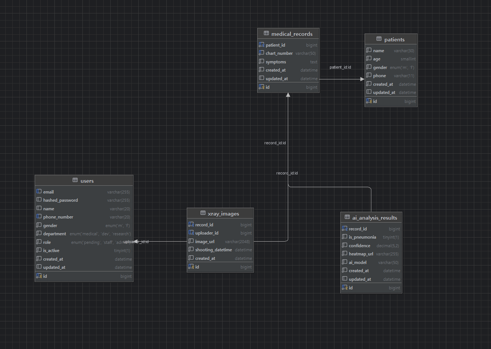

# 3일차 DB 마이그레이션

## 1. DB 마이그레이션이란?

DB 마이그레이션은 애플리케이션의 모델 변경 사항을 데이터베이스 스키마에 반영하는 작업이다.

프로젝트를 개발하다 보면 테이블이 새로 추가되거나, 컬럼이 변경되거나, 제약조건이 추가되는 일이 자주 발생한다.

이때 수동으로 SQL을 작성해서 매번 데이터베이스를 수정할 수도 있지만, 협업 환경에서는 변경 이력을 추적하고 동일한 작업을 반복 가능하게 만드는 것이 더 중요하다.

Alembic은 SQLAlchemy 프로젝트에서 이러한 스키마 변경을 버전 단위로 관리하기 위한 도구이다.

Alembic을 사용하면 다음과 같은 장점이 있다.

- 모델 변경 이력을 파일로 남길 수 있다.
- 팀원들이 동일한 스키마 상태를 유지할 수 있다.
- 배포 환경에서도 같은 방식으로 스키마를 반영할 수 있다.
- 이전 버전으로 되돌리는 작업도 관리할 수 있다.

---

## 2. 이 프로젝트에서의 마이그레이션 구조

현재 프로젝트는 FastAPI, SQLAlchemy, MySQL, Alembic 조합을 사용한다.

Alembic 관련 핵심 파일은 다음과 같다.

- `alembic.ini`
- `alembic/env.py`
- `alembic/versions/`
- `app/models/__init__.py`

특히 `app/models/__init__.py`는 매우 중요하다.

Alembic은 메타데이터를 읽어서 어떤 테이블을 생성해야 하는지 판단하는데, 이때 모델들이 실제로 import되어 있어야 한다.

따라서 모델 파일을 새로 만들었더라도 `app/models/__init__.py`에 import하지 않으면 Alembic이 해당 모델을 인식하지 못할 수 있다.

이번 작업에서는 `app/models/__init__.py`를 기준으로 모델을 로드할 수 있도록 정리했고, 깨진 import 경로와 일부 relationship 정의도 함께 수정했다.

---

## 3. DataGrip에서 확인한 스키마

아래 이미지는 DataGrip에서 마이그레이션 이후 스키마를 확인한 화면이다.

---
