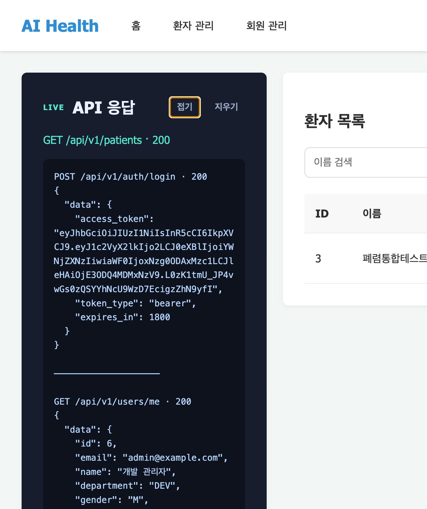
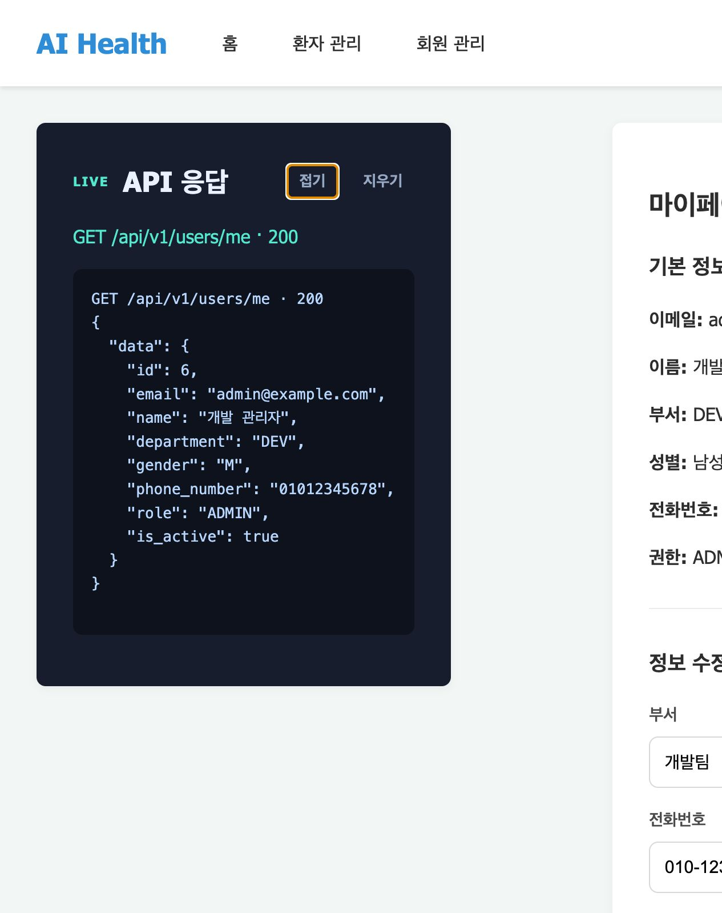
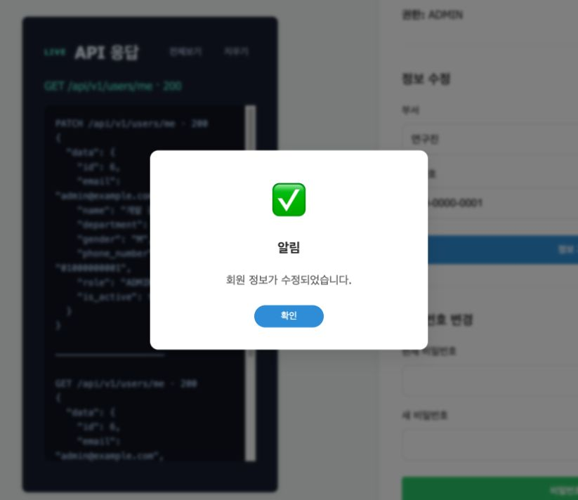
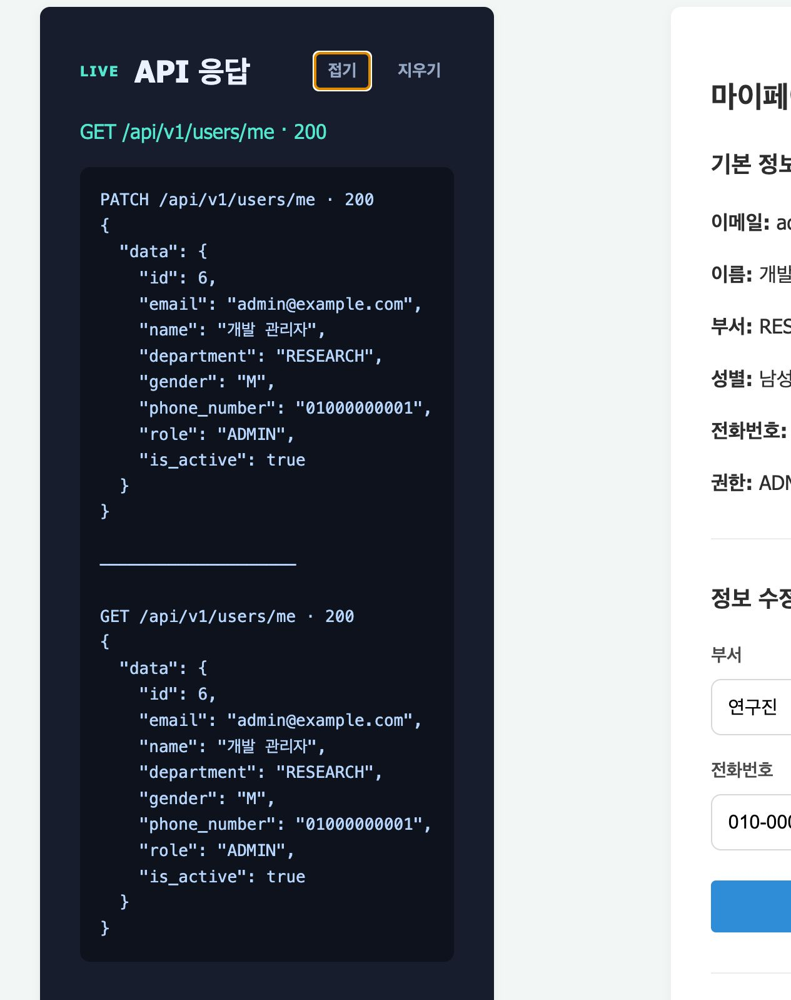
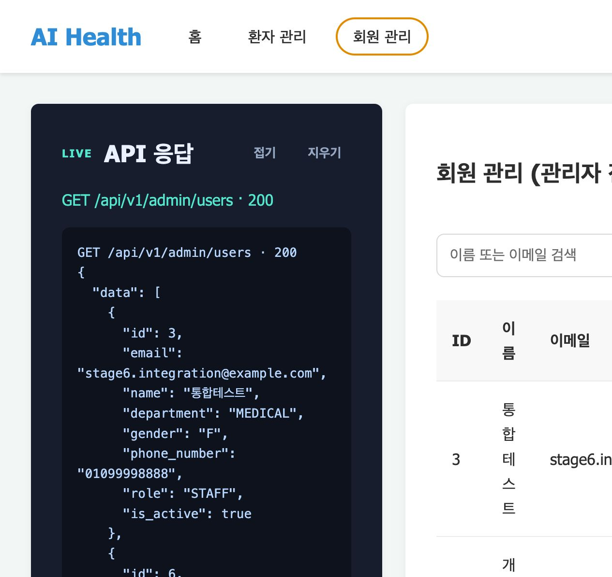
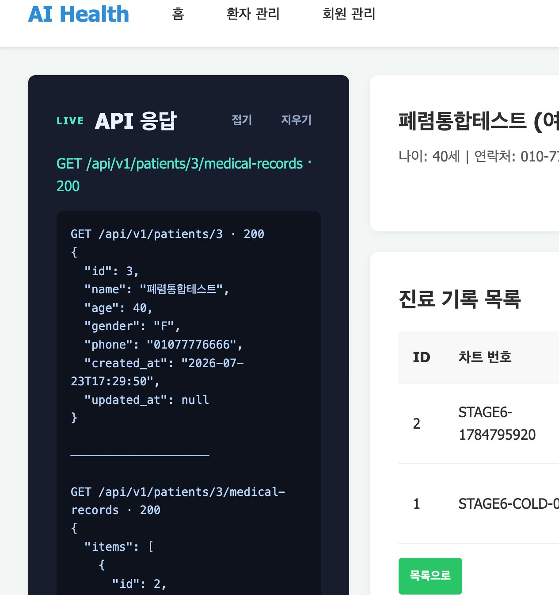
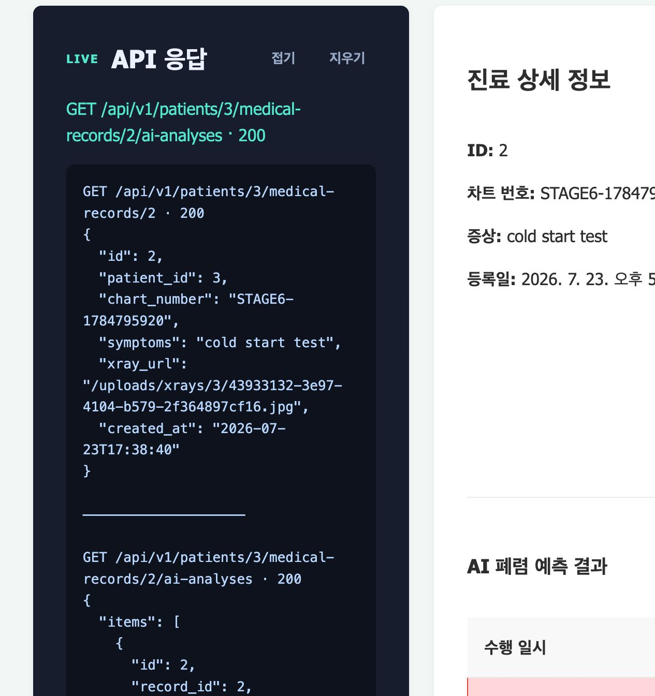
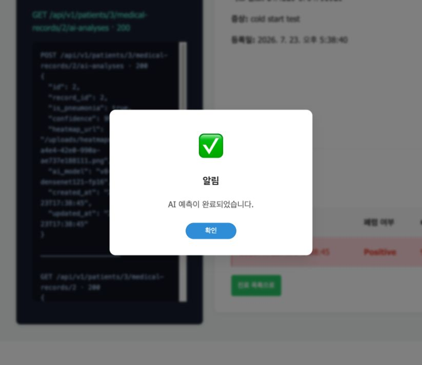
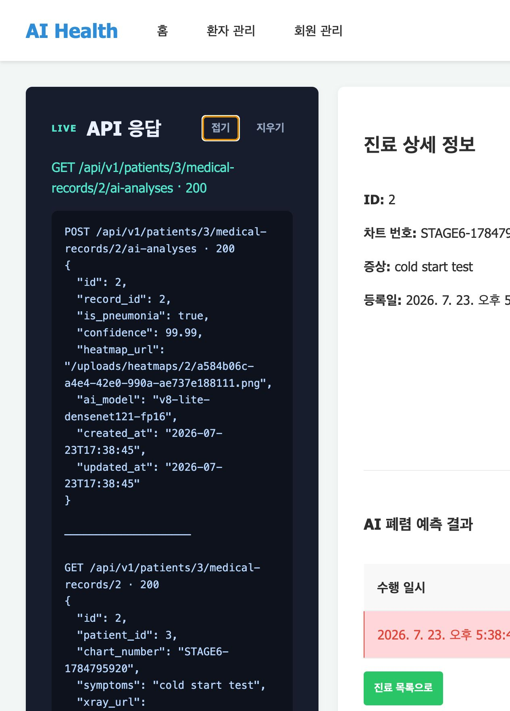
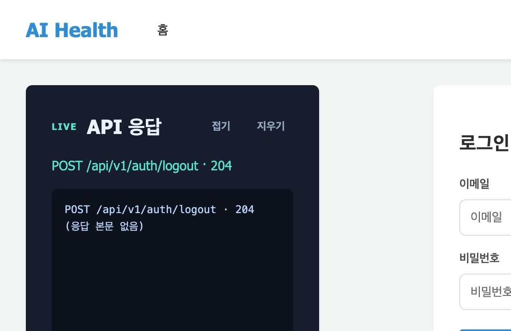

# 7일차 앱 실행 화면

## 실행 방법

각자 저장소를 클론한 뒤 프로젝트 루트 디렉터리에서 FastAPI 앱을 실행한다.

```bash
uv run alembic upgrade head
.venv/bin/python scripts/seed_admin.py
fastapi run app/main.py
```

실행 후 `http://localhost:8000/`에 접속한다.

### 실행 전 확인

- `.env`에 MySQL 접속 정보와 JWT 설정이 준비되어 있어야 한다.
- MySQL과 필요한 외부 서비스가 먼저 실행되어 있어야 한다.
- 로컬의 8000번 포트를 다른 프로세스가 사용 중이면 해당 프로세스를 종료한 뒤 앱을 실행한다.

```bash
lsof -nP -iTCP:8000 -sTCP:LISTEN
```

### 테스트 계정과 권한

회원가입 직후 계정 권한은 `PENDING`이다. `PENDING` 사용자는 로그인과 마이페이지 이용은 가능하지만 환자·진료·AI 기능에는 접근할 수 없다.

전체 기능을 검증하려면 관리자가 계정을 다음 권한 중 하나로 승인해야 한다.

| 권한 | 이용 범위 |
|---|---|
| `PENDING` | 로그인, 로그아웃, 마이페이지 |
| `STAFF` | 환자·진료·AI 기능 |
| `ADMIN` | 전체 기능과 회원 권한 관리 |

팀 공용 문서에는 실제 비밀번호를 기록하지 않는다. 테스트 계정 정보는 팀에서 합의한 별도 보안 채널 또는 로컬 개발 DB에서 관리한다.

## 프론트엔드 API 연결

| 프론트 기능 | Method | Endpoint | Header·Body | 성공 시 화면 동작 |
|---|---|---|---|---|
| 회원가입 | `POST` | `/api/v1/auth/signup` | JSON 회원 정보 | 로그인 페이지로 이동 |
| 로그인 | `POST` | `/api/v1/auth/login` | 이메일·비밀번호 JSON | Access Token 저장 후 권한에 따라 홈 또는 환자 목록으로 이동 |
| 토큰 재발급 | `POST` | `/api/v1/auth/refresh` | HttpOnly Refresh Token 쿠키 | 새 Access Token을 저장하고 기존 요청 재시도 |
| 로그아웃 | `POST` | `/api/v1/auth/logout` | Bearer Access Token | 클라이언트 토큰 제거 후 로그인 페이지로 이동 |
| 회원 탈퇴 | `DELETE` | `/api/v1/auth/signout` | Bearer Access Token | 계정 삭제 후 로그아웃 |
| 내 정보 조회 | `GET` | `/api/v1/users/me` | Bearer Access Token | 사용자 정보와 내비게이션 갱신 |
| 내 정보 수정 | `PATCH` | `/api/v1/users/me` | Bearer Access Token, 부서·휴대폰 번호 JSON | 변경된 정보를 마이페이지에 다시 표시 |
| 비밀번호 변경 | `PATCH` | `/api/v1/users/me/password` | Bearer Access Token, 현재·새 비밀번호 JSON | 완료 알림 후 비밀번호 입력 폼 초기화 |
| 환자 등록·조회 | `POST`, `GET` | `/api/v1/patients`, `/api/v1/patients/{patient_id}` | Bearer Access Token, 환자 JSON | 환자 목록·상세 화면 표시 |
| 환자 수정·삭제 | `PATCH`, `DELETE` | `/api/v1/patients/{patient_id}` | Bearer Access Token, 수정 JSON | 환자 정보 갱신 또는 목록 이동 |
| 진료기록 등록·목록 | `POST`, `GET` | `/api/v1/patients/{patient_id}/medical-records` | Bearer Access Token, multipart 또는 조회 조건 | X-Ray 등록 또는 진료기록 목록 표시 |
| 진료기록 상세 | `GET` | `/api/v1/patients/{patient_id}/medical-records/{record_id}` | Bearer Access Token | 차트·증상·X-Ray 표시 |
| AI 분석 실행·목록 | `POST`, `GET` | `/api/v1/patients/{patient_id}/medical-records/{record_id}/ai-analyses` | Bearer Access Token | 폐렴 여부·신뢰도·모델 표시 |
| 관리자 회원 목록 | `GET` | `/api/v1/admin/users` | ADMIN Bearer Access Token | 회원 검색·권한 목록 표시 |
| 관리자 권한 변경 | `PATCH` | `/api/v1/admin/users/{user_id}/role` | ADMIN Bearer Access Token, 권한 JSON | 변경된 회원 권한 표시 |

각 endpoint의 실제 응답 구조에 맞춰 `{ "data": ... }`, `items`, 페이지네이션을
화면 데이터로 변환했다. 부서, 성별, 권한 값은 백엔드 enum인 `DEV`,
`MEDICAL`, `RESEARCH`, `M`, `F`, `PENDING`, `STAFF`, `ADMIN` 형식을 사용한다.

### 공통 오류 처리

| 상태 코드 | 대표 상황 | 프론트 동작 |
|---|---|---|
| `400` | 현재 비밀번호 불일치 | 서버 오류 메시지를 알림으로 표시 |
| `401` | 로그인 실패 또는 Access Token 만료 | 로그인 실패 표시 또는 Refresh Token으로 재발급 시도 |
| `403` | `PENDING` 사용자 또는 권한 부족 | 접근 제한 안내 후 허용된 화면으로 이동 |
| `409` | 이메일·휴대폰 번호 중복 | 서버 오류 메시지를 입력 화면에 표시 |
| `422` | 입력값 또는 enum 형식 오류 | 검증 오류 메시지 표시 |
| `500` | 서버 내부 오류 | 잠시 후 다시 시도하도록 안내 |

## API 응답 패널

화면 왼쪽에 고정된 **API 응답** 패널에서 다음 정보를 확인할 수 있다.

- 요청 Method와 Endpoint
- HTTP 상태 코드
- JSON Response Body
- 성공 또는 실패 상태

로그인·토큰 재발급 응답의 Access Token도 API 연결 확인을 위해 패널에 표시한다.
실행 화면이나 로그를 외부에 공유할 때는 토큰이 노출되지 않도록 주의한다.

화면을 스크롤해도 데스크톱에서는 패널이 왼쪽에 유지된다. 모바일 화면에서는 콘텐츠 위에 한 열로 배치된다.
긴 API 응답은 패널의 **전체보기** 버튼으로 높이 제한을 해제한 뒤 전체 페이지로 캡처한다.
성공 팝업이 있는 기능은 팝업이 잘리지 않는 화면 캡처와 API 전체 응답 캡처를 각각 첨부했다.

## 실행 화면 캡처

### 1. 관리자 로그인

`POST /api/v1/auth/login`, `GET /api/v1/users/me`, `GET /api/v1/patients`가
차례로 성공했다.



### 2. 내 정보 조회

`GET /api/v1/users/me` 응답의 관리자 정보가 마이페이지에 표시된다.



### 3. 내 정보 수정

`PATCH /api/v1/users/me`로 부서와 전화번호를 수정하고 성공 알림을 확인했다.
캡처 후 관리자 정보는 원래 값으로 복구했다.





### 4. 관리자 회원 목록

`GET /api/v1/admin/users`가 `200 OK`를 반환하고 회원 권한을 표시한다.



### 5. 환자 상세와 진료기록 목록

`GET /api/v1/patients/{patient_id}`와
`GET /api/v1/patients/{patient_id}/medical-records`가 성공했다.



### 6. 진료기록 상세와 AI 분석 목록

진료기록 상세와 기존 AI 분석 결과 목록을 실제 중첩 endpoint로 조회했다.



### 7. AI 분석 실행

`POST /api/v1/patients/{patient_id}/medical-records/{record_id}/ai-analyses`가
`200 OK`를 반환하고 완료 알림을 표시했다.





### 8. 로그아웃

`POST /api/v1/auth/logout`의 `204 No Content` 응답 후 로그인 화면으로 이동했다.



## 추가 API 검증

실행 중인 앱에 대해 브라우저 세션과 별도로 다음 endpoint를 확인했다.

| Endpoint | 결과 |
|---|---|
| `POST /api/v1/auth/refresh` | `200 OK` |
| `PATCH /api/v1/users/me/password` | `200 OK`, 비밀번호 변경 메시지 확인 |
| `POST /api/v1/patients` | `201 Created` |
| `PATCH /api/v1/patients/{patient_id}` | `200 OK` |
| `POST /api/v1/patients/{patient_id}/medical-records` | `201 Created` |
| `DELETE /api/v1/patients/{patient_id}` | `204 No Content`, 임시 데이터 정리 완료 |

로컬 DB가 이전 revision에 머물러 있을 때 환자 삭제 cascade가 동작하지 않는 것을
확인했으며, `alembic upgrade head`로 최신 revision을 적용한 뒤 `204 No Content`를
재검증했다.

```text
Ran 8 tests in 0.143s
OK
```

## 확인 사항

- API 연결 코드는 `static/apis.js`에서 관리한다.
- 로그인 상태와 라우팅은 `static/app.js`에서 관리한다.
- 왼쪽 API 응답 패널은 `static/index.html`과 `static/styles.css`에 구현되어 있다.
- 캡처 이미지는 `docs/images/7일차/`에 저장한 뒤 이 문서에 상대 경로로 첨부한다.
