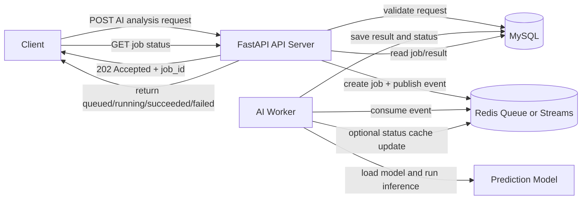
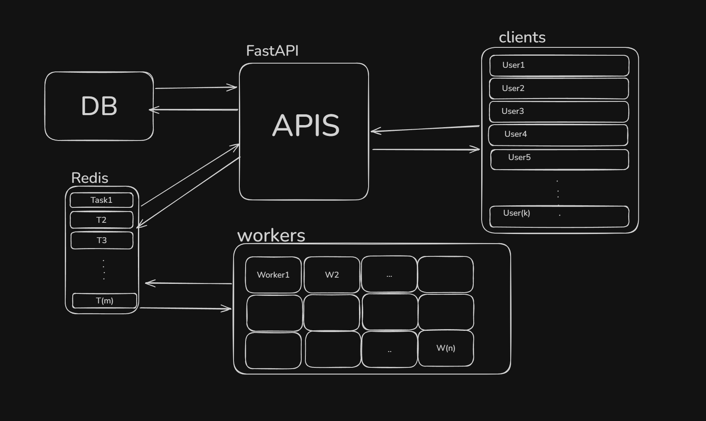

# 9일차 동시성 문제 해결을 위한 아키텍처 설계

## 문서 목적
- 현재 프로젝트의 AI 분석 기능에서 발생할 수 있는 동시성 문제를 이해한다.
- FastAPI와 Redis를 활용한 Event-Driven Architecture(EDA)의 핵심 개념을 팀원들과 함께 정리한다.
- 우리 저장소에 바로 적용할 수 있는 설계 방향을 도출한다.

## 한 줄 요약
현재 구현은 API 요청 안에서 AI 추론을 직접 수행하는 구조라서 응답 지연, 중복 작업, 워커 확장 한계가 생길 수 있다.  
이를 해결하려면 FastAPI는 요청 접수와 상태 조회에 집중하고, Redis는 작업 대기열과 이벤트 전달을 담당하며, AI Worker는 비동기적으로 추론을 처리하는 구조로 분리하는 것이 적절하다.

---

## 1. 현재 프로젝트 구조 이해

현재 저장소에서 폐렴 예측 흐름은 아래와 같다.

1. 클라이언트가 AI 분석 실행 API를 호출한다.
2. FastAPI가 진료기록과 X-ray 존재 여부를 검증한다.
3. 서비스 계층이 `worker.model.predict_pneumonia()`를 같은 요청 안에서 실행한다.
4. 예측 결과와 heatmap 파일을 저장한 뒤 DB에 분석 결과를 기록한다.
5. 응답을 반환한다.

관련 코드:
- API 엔드포인트: [app/apis/ai_analyses.py](/mnt/c/dev/AH_web_dev/app/apis/ai_analyses.py:57)
- 서비스 로직: [app/services/ai_analysis_service.py](/mnt/c/dev/AH_web_dev/app/services/ai_analysis_service.py:71)
- 모델 로딩: [app/main.py](/mnt/c/dev/AH_web_dev/app/main.py:21)
- 추론 모듈: [worker/model.py](/mnt/c/dev/AH_web_dev/worker/model.py:35)
- 중복 저장 방지 제약: [app/models/ai_analysis_result.py](/mnt/c/dev/AH_web_dev/app/models/ai_analysis_result.py:19)

### 현재 구현에서 눈여겨볼 점
- API는 `asyncio.wait_for(..., timeout=3.0)`으로 3초 타임아웃을 건다.
- 실제 추론은 `asyncio.to_thread()`로 별도 스레드에서 돌리지만, 요청 자체는 그 결과를 기다린다.
- `AIAnalysisResult` 테이블에는 `(record_id, ai_model)` 유니크 제약이 있어 결과 저장 중복은 일부 방지한다.
- 앱 시작 시 모델을 미리 로딩하지만, 추론 실행 자체는 여전히 요청 경로 안에 있다.

즉, "비동기 함수"를 쓰고는 있지만 아키텍처 관점에서는 여전히 **동기 응답 중심 구조**에 가깝다.

---

## 2. 왜 동시성 문제가 생길까

### 2.1 긴 작업이 API 응답 시간을 잠식한다
AI 추론은 CPU/GPU를 많이 쓰고 파일 입출력도 동반한다.  
이 작업을 API 요청 안에서 직접 처리하면 요청 하나가 오래 붙잡혀 있게 된다.

예상 문제:
- 동시에 여러 건의 분석 요청이 오면 응답 시간이 급격히 늘어남
- FastAPI 인스턴스 수를 늘려도 AI 추론이 병목이면 큰 효과가 없음
- 타임아웃은 났는데 실제 추론 스레드는 계속 실행될 수 있어 자원 낭비가 발생할 수 있음

### 2.2 같은 리소스에 대한 중복 요청이 들어올 수 있다
예를 들어 같은 진료기록에 대해 사용자가 연속 클릭하거나, 프론트엔드 재시도 로직이 동작하면 동일한 분석 요청이 여러 번 들어올 수 있다.

예상 문제:
- 같은 이미지에 대한 중복 추론
- heatmap 파일 중복 생성
- 저장 시점 경쟁 상태(race condition)
- 사용자는 "실패한 줄 알았는데 실제로는 처리 중"인 상태를 이해하기 어려움

### 2.3 실패 복구와 재시도가 어렵다
현재 구조에서는 추론 실패, 파일 저장 실패, DB 저장 실패가 같은 요청 흐름 안에 묶여 있다.

예상 문제:
- 어느 단계에서 실패했는지 추적이 어려움
- 재시도 정책을 API 요청 레벨에서 처리하기 어려움
- 실패한 작업을 나중에 다시 소비하는 구조가 없음

---

## 3. Event-Driven Architecture(EDA)란 무엇인가

EDA는 "어떤 사건(event)이 발생했을 때, 그 사건을 구독하는 컴포넌트가 비동기적으로 반응하는 구조"를 말한다.

이 과제에 맞게 바꾸어 말하면:
- "AI 분석 요청이 들어왔다"는 사건을 FastAPI가 만든다.
- 그 사건을 Redis 큐 또는 Redis Streams에 적재한다.
- AI Worker가 그 이벤트를 소비해서 실제 추론을 처리한다.
- 처리 완료/실패 이벤트 또는 상태 갱신을 남긴다.

핵심 아이디어는 다음과 같다.
- API 서버는 빠르게 요청만 접수한다.
- 긴 작업은 백그라운드 워커가 맡는다.
- 컴포넌트 간 결합도를 낮추고, 부하를 분산한다.

---

## 4. 왜 Redis를 사용하는가

Redis는 메모리 기반 저장소로 속도가 빠르고, 큐/스트림/캐시 역할을 동시에 수행할 수 있다.

이 과제에서 Redis를 쓰는 이유:
- 작업 대기열(queue) 구현이 쉽다.
- FastAPI와 AI Worker를 느슨하게 연결할 수 있다.
- 대기 중인 작업, 처리 중인 작업, 재시도 대상 등을 관리하기 좋다.
- 나중에 워커 수를 늘려 수평 확장하기 쉽다.

### Redis에서 고려할 수 있는 두 가지 방식

#### 4.1 간단한 작업 큐 방식
- `LPUSH` / `BRPOP` 같은 리스트 기반 큐 사용
- 구현이 단순하다.
- 과제 수준에서 설명하기 쉽다.

장점:
- 학습 난이도가 낮다.
- 빠르게 시제품을 만들 수 있다.

단점:
- 메시지 추적, consumer group, 장애 복구 설계는 직접 더 고민해야 한다.

#### 4.2 Redis Streams 방식
- 이벤트 스트림과 consumer group을 활용
- 각 워커가 어떤 메시지를 처리 중인지 추적 가능

장점:
- EDA 설명에 더 잘 맞는다.
- 재처리, ack, pending message 관리에 유리하다.

단점:
- 초기 개념 이해와 운영 복잡도가 올라간다.

이번 문서에서는 **개념 설명은 EDA + Redis Streams 관점으로 하되**, 실제 초기 구현은 **단순 큐 또는 Celery + Redis**로 시작해도 무방하다고 본다.

---

## 5. 제안 아키텍처

### 역할 분리

#### FastAPI
- 요청 검증
- 작업(Job) 생성
- Redis에 작업 이벤트 발행
- 즉시 `job_id` 반환
- 작업 상태 조회 API 제공

#### Redis
- 작업 큐 또는 이벤트 스트림 보관
- 작업 상태 캐시
- 워커와 API 서버 사이의 중간 버퍼 역할

#### AI Worker
- Redis에서 작업 소비
- 모델 추론 수행
- heatmap 저장
- DB에 결과 반영
- 작업 상태를 `queued -> running -> succeeded / failed`로 갱신

#### MySQL
- 최종 분석 결과 영속화
- 작업 이력 저장
- 중복 요청 제어를 위한 제약 조건 관리

---

## 6. 권장 처리 흐름

### 6.1 분석 요청 접수
1. 클라이언트가 `POST /ai-analyses` 요청
2. FastAPI가 입력과 권한 검증
3. DB에 작업 레코드 생성
4. Redis에 `AI_ANALYSIS_REQUESTED` 이벤트 발행
5. 클라이언트에 `202 Accepted`와 `job_id` 반환

### 6.2 백그라운드 추론
1. AI Worker가 Redis에서 이벤트 소비
2. 작업 상태를 `running`으로 변경
3. 모델 추론 및 heatmap 생성
4. 결과 저장
5. 작업 상태를 `succeeded` 또는 `failed`로 갱신

### 6.3 상태 조회
클라이언트는 아래 방식 중 하나로 상태를 확인할 수 있다.
- Polling: `GET /jobs/{job_id}`
- SSE: 서버가 상태 변경을 푸시
- WebSocket: 실시간 양방향 통신

과제 수준에서는 **Polling 기반 상태 조회 API**만 있어도 충분하다.

---

## 7. 아키텍처 도식

아래 다이어그램은 Excalidraw로 옮기기 전, 구조를 빠르게 합의하기 위한 텍스트 버전이다.

### Excalidraw에 넣으면 좋은 요소
- Client
- FastAPI
- Redis
- AI Worker
- MySQL
- heatmap 파일 저장 위치
- 상태 전이: `queued`, `running`, `succeeded`, `failed`

---

## Excalidraw 그림

---

## 8. 동시성 문제를 줄이기 위한 핵심 설계 포인트

### 8.1 Idempotency Key 또는 중복 작업 방지 키
같은 요청이 반복되어도 결과가 한 번만 생성되도록 해야 한다.

예시:
- `(record_id, ai_model)` 조합으로 단일 작업만 허용
- 이미 `queued` 또는 `running` 상태인 작업이 있으면 기존 `job_id`를 반환

현재 프로젝트에는 결과 저장 단계에서 `(record_id, ai_model)` 유니크 제약이 있다.  
하지만 이상적인 구조에서는 **작업 생성 단계부터 중복을 줄이는 정책**이 추가되어야 한다.

### 8.2 명확한 상태 전이
작업 상태는 명확해야 운영과 디버깅이 쉬워진다.

권장 상태:
- `queued`
- `running`
- `succeeded`
- `failed`
- `cancelled` (선택)

### 8.3 재시도 정책
일시적인 실패는 재시도할 수 있어야 한다.

예시:
- Redis 연결 오류
- 일시적인 파일 시스템 오류
- 외부 모델 리소스 로드 실패

주의:
- 재시도 가능한 실패와 즉시 실패 처리해야 하는 경우를 분리해야 한다.
- 재시도 시에도 중복 결과 저장이 발생하지 않도록 해야 한다.

### 8.4 At-least-once 처리 전제
큐 기반 시스템은 메시지가 한 번 이상 전달되는 경우를 기본으로 보는 것이 현실적이다.

즉, "메시지가 중복 소비될 수 있다"는 전제로 설계해야 하며, 이를 보완하는 것이 idempotency이다.

### 8.5 관측 가능성(Observability)
작업 기반 구조에서는 로그와 메트릭이 특히 중요하다.

추적하면 좋은 정보:
- `job_id`
- `record_id`
- `ai_model`
- 요청 시각 / 시작 시각 / 종료 시각
- 실패 원인
- 재시도 횟수

---

## 9. 우리 프로젝트에 적용하면 무엇이 달라지는가

### 현재 방식
- 요청이 들어오면 같은 흐름에서 예측까지 수행
- 응답이 추론 시간에 직접 영향받음
- 타임아웃이 나도 백그라운드 스레드 정리가 복잡할 수 있음

### 개선 후 방식
- 요청은 즉시 접수하고 빠르게 응답
- 추론은 워커가 별도 처리
- API 서버와 AI 워커를 독립적으로 확장 가능
- 실패 작업 재처리와 상태 추적이 쉬워짐

### 적용 시 특히 좋아지는 지점
- 동시에 여러 사용자가 AI 분석을 눌러도 API 응답성 유지
- 모델 추론 서버를 API 서버와 분리 가능
- 추후 다른 AI 분석 모델이 추가되어도 작업 타입만 확장하면 대응 가능

---

## 10. 구현 관점에서의 현실적인 선택지

### 선택지 A. 직접 Redis 큐 구현
구성:
- FastAPI
- Redis
- 별도 Worker 프로세스

장점:
- 내부 동작을 팀이 직접 이해하기 좋다.
- 학습 과제와 잘 맞는다.

단점:
- 재시도, ack, 모니터링 등을 직접 설계해야 한다.

### 선택지 B. Celery + Redis
구성:
- FastAPI
- Redis broker
- Celery worker

장점:
- 작업 큐, 재시도, 워커 분리 기능이 이미 잘 정리되어 있다.
- 실무에서 익숙한 패턴이다.

단점:
- 러닝커브가 조금 있다.
- 내부 동작을 추상화가 가리기 때문에 학습 목적에서는 직접 구현보다 이해가 덜 선명할 수 있다.

### 이 문서의 권장안
- **학습 문서와 설계 설명은 Redis 기반 EDA로 정리**
- **초기 구현은 Celery + Redis 또는 단순 Redis 큐 중 팀 숙련도에 맞게 선택**

---

## 11. 단계별 적용 제안

### 1단계. Job 테이블 또는 작업 상태 컬럼 설계
최소한 아래 정보가 필요하다.
- `job_id`
- `record_id`
- `ai_model`
- `status`
- `requested_by`
- `created_at`
- `started_at`
- `finished_at`
- `error_message`

### 2단계. 분석 요청 API를 즉시 응답형으로 변경
현재 `200 OK + 결과 반환` 구조를 아래처럼 변경한다.
- `202 Accepted + job_id 반환`

### 3단계. Worker 프로세스 분리
`worker.model`을 API 요청 안에서 직접 호출하지 않고, 별도 워커에서만 실행되게 한다.

### 4단계. 상태 조회 API 추가
예:
- `GET /api/v1/jobs/{job_id}`
- `GET /api/v1/patients/{patient_id}/medical-records/{record_id}/ai-analyses/latest`

### 5단계. 재시도와 운영 로그 추가
작업 실패 시 재시도 정책과 모니터링 포인트를 붙인다.

---

## 12. 팀 토론 포인트

스터디할 때 아래 질문으로 같이 논의하면 좋다.

1. 현재 3초 타임아웃 구조는 어떤 상황에서 가장 먼저 깨질까?
2. 결과 저장 중복만 막는 것과 "작업 생성 중복"까지 막는 것은 어떤 차이가 있을까?
3. 우리 프로젝트는 Redis 리스트 큐와 Redis Streams 중 어떤 쪽이 더 적합할까?
4. FastAPI 인스턴스와 AI Worker를 분리하면 배포 구조는 어떻게 바뀔까?
5. 실시간 상태 조회는 Polling만으로 충분할까, SSE/WebSocket이 필요할까?

---

## 13. 결론

현재 프로젝트는 기능적으로 AI 예측이 동작하지만, 긴 추론 작업을 API 요청 안에서 직접 처리하기 때문에 동시성·확장성·복구성 측면에서 한계가 있다.

이를 개선하기 위한 가장 자연스러운 방향은 다음과 같다.
- FastAPI는 요청 접수와 상태 조회에 집중한다.
- Redis는 이벤트 전달과 작업 대기열을 담당한다.
- AI Worker는 독립적으로 추론을 수행한다.
- MySQL은 작업 상태와 최종 결과를 안정적으로 저장한다.

즉, **"요청 처리"와 "AI 실행"을 분리하는 것**이 이번 아키텍처 설계의 핵심이다.

---

## 부록 A. 현재 코드 기준으로 개선 필요 포인트

- [app/apis/ai_analyses.py](/mnt/c/dev/AH_web_dev/app/apis/ai_analyses.py:77)
  - 요청 안에서 결과를 기다리는 구조라 응답 시간이 추론 시간에 묶인다.
- [app/services/ai_analysis_service.py](/mnt/c/dev/AH_web_dev/app/services/ai_analysis_service.py:106)
  - `asyncio.to_thread()`는 비동기 보조 수단이지, 워커 분리 아키텍처 자체를 제공하지는 않는다.
- [app/models/ai_analysis_result.py](/mnt/c/dev/AH_web_dev/app/models/ai_analysis_result.py:19)
  - 유니크 제약은 유용하지만, 작업 생성 단계의 중복 방지까지는 해결하지 못한다.
- [app/main.py](/mnt/c/dev/AH_web_dev/app/main.py:21)
  - 모델 preload는 시작 시간 최적화에는 도움이 되지만, 요청 경로의 긴 작업 문제 자체를 없애지는 못한다.

## 부록 B. 문서 마무리 체크리스트

- [x] FastAPI + Redis 기반 EDA 개념 설명
- [x] 현재 프로젝트에 맞춘 동시성 문제 설명
- [x] FastAPI와 AI Worker 역할 분리 명시
- [x] Redis를 활용한 작업 대기열 구조 설명
- [ ] Excalidraw 아키텍처 이미지 작성
- [ ] 이미지 캡처를 `docs/images/9일차/` 아래에 추가
- [ ] 최종 PR에 문서 변경 이유와 적용 범위 요약
